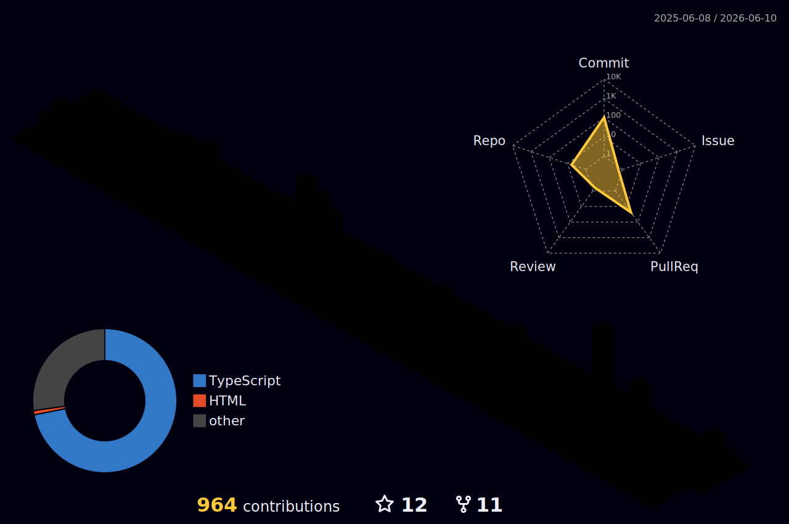

---

## 👋 About Me

I'm a full-stack engineer with 12+ years of experience building products across SaaS, e-commerce, and fintech — from pixel-perfect frontends to scalable backend systems and cloud infrastructure.

| | |
|---|---|
| 🏗️ **Currently building** | Shopify embedded apps & marketplace tooling |
| 💬 **Ask me about** | Laravel · React/TypeScript · Shopify integrations · Node.js |
| 🤝 **Open to** | Collaborations, freelance, and interesting open source work |
| 📫 **Reach me** | [linkedin.com/in/mubin-khalid](https://linkedin.com/in/mubin-khalid) |
---

## 🧰 Tech Stack

<b>💻 Languages</b>

 

<b>🖼️ Frontend</b>

 

<b>⚙️ Backend</b>

 

<b>🛢️ Databases</b>

 

<b>☁️ Cloud, Hosting & Infra</b>

 

<b>📊 Data, Analytics & Tooling</b>

 

---

## 📊 GitHub Stats

